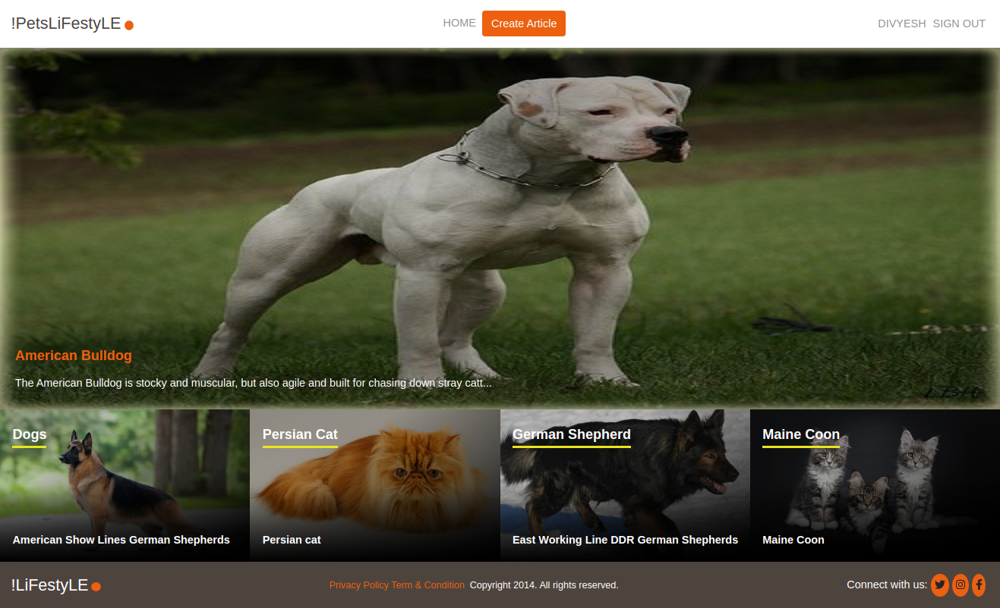
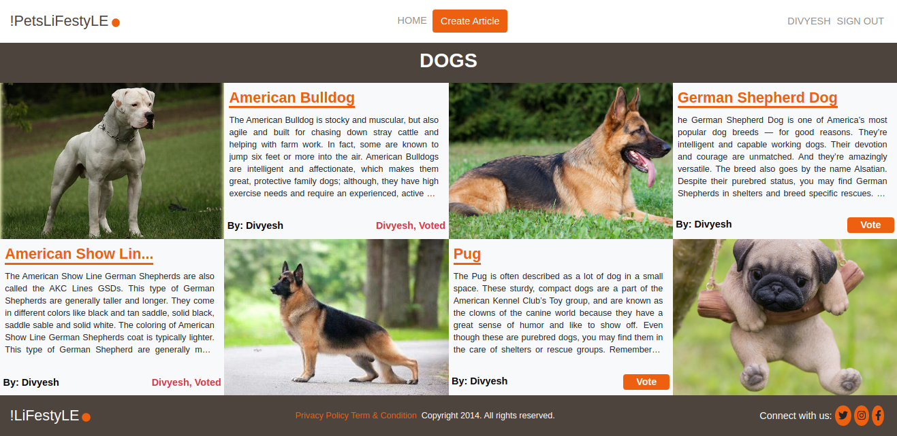

# RoR Capstone: !PeTsLifestyle App


**Articles under a category page**


> This is the RoR Capstone project. The main goal for this project was to build a lifestyle article app by using Given Design and completing the requirements mentioned in the project [requirement](https://www.notion.so/Lifestyle-articles-b82a5f10122b4cec924cd5d4a6cf7561).
**!PeTsLifestyLE** The website is about reading and writing an article about pets. Users can also vote and comment on an article but to do that users need to signup and login.

## Features
- User signup and log in using name only (Name must be unique)
- Create Category
- Create Article
- Add an image to an article during article creations
- proper validations on form fields.
- Display a Home page with a list of categories with the most recent article.
- User can vote for an article.
- User can comment on an article [Extra Feature].
- The article which has the biggest number of votes will be displayed on the Home page.
- Category page displays all the articles under that category.

## Built With

- Ruby v2.7.2
- Ruby on Rails v5.2.4
- Bootstrap

## Live Demo

Checkout the live demo at [Live](https://lit-wave-20571.herokuapp.com/)


## Getting Started

To get a local copy up and running follow these simple example steps.

1. If you're running the Windows Operating System, open your command prompt. On Linux, Open your terminal.

2. Copy and paste the following code into the Terminal:

   ```https://github.com/Div685/ror-lifestyle-app.git ```

3. Press Enter.

4. Once the repository has been cloned, navigate inside the repository

5. After you will need to update and install some of the depedency. Use following command to install the packages
 - `bundle install`
 - `yarn install`
 - `rails db:create`
 - `rake db:migrate`

6. once you install the packages and migrate the database you can run the server
 - `rails s` or `rails server`

7. Enjoy


### Prerequisites

Ruby: 2.7.2
Rails: 5.2.3
Postgres: >=9.5

### Setup

Instal gems with:

```
bundle install
```

Setup database with:

```
   rails db:create
   rails db:migrate
```

### Github Actions

To make sure the linters' checks using Github Actions work properly, you should follow the next steps:

1. On your recently forked repo, enable the GitHub Actions in the Actions tab.
2. Create the `feature/branch` and push.
3. Start working on your milestone as usual.
4. Open a PR from the `feature/branch` when your work is done.


### Usage

Start server with:

```
    rails server
```

Open `http://localhost:3000/` in your browser.

### Run tests

```
    rspec --order defined --format documentation
```
- Please Add `--order defined` flag if you runnig all the tests at once.
- you can also run test individually by specifying `file name`
e.g ` rspec spec/models/like_spec.rb ` 

> Tests will be added by Microverse students. There are no tests for initial features in order to make sure that students write all tests from scratch.

## Authors

👤 **Divyesh Patel**

- GitHub: [@Div685](https://github.com/Div685)
- Twitter: [@div_685](https://twitter.com/div_685)
- LinkedIn: [Divyesh Patel](https://www.linkedin.com/in/divyesh-daxa-patel)

## 🤝 Contributing

Contributions, issues and feature requests are welcome!

Feel free to check the [issues page](https://github.com/Div685/ror-lifestyle-app/issues).

## Show your support

Give a ⭐️ if you like this project!

## Acknowledgments

- I would like to thank [Nelson Sakwa](https://www.behance.net/gallery/14554909/liFEsTlye-Mobile-version) for providing such a wonderfull design. check out his other design on [Behance](https://www.behance.net/sakwadesignstudio).
- [Ruby-doc](https://ruby-doc.org/core-2.6.5)
- [Rails-doc](https://guides.rubyonrails.org/)